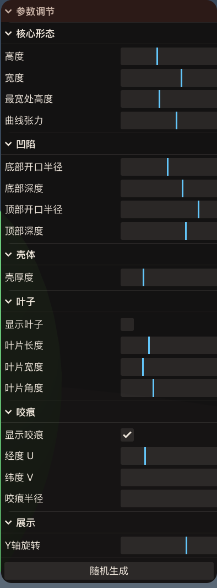

# 参数化苹果设计系统 — 技术报告

## 1. 项目概述

以苹果为核心形态语言的参数化设计系统。苹果不是固定的三维模型，而是一套可解释的形状语法——从球形原始体出发，通过参数驱动演化为可识别的苹果形态，再延伸为杯子、碗等设计对象。

**技术栈：** Vite + TypeScript + Three.js + three-bvh-csg

**线上地址：** https://dangsq.github.io/1st/

---

## 2. 参数化设计

### 核心思路

每个参数对应一个明确的几何语义，不依赖底层网格实现。参数之间正交、独立可调，用户可以直觉地理解"调这个滑块会发生什么"。

### 参数体系（共 17 个）

#### 核心形态 — 控制苹果的基本轮廓

| 参数 | 含义 | 范围 | 默认值 |
|---|---|---|---|
| `height` | 整体高度 | 0.8 – 1.2 | 1.0 |
| `width` | 整体宽度 | 0.8 – 1.2 | 1.0 |
| `maxWidthHeight` | 最宽处的高度位置（越小越靠下） | 0.42 – 0.7 | 0.55 |
| `bottomRadius` | 底部凹陷的开口半径 | 0.1 – 0.35 | 0.2 |
| `bottomDepth` | 底部凹陷深度（0 为无凹陷） | 0.0 – 0.3 | 0.1 |
| `topRadius` | 顶部凹陷的开口半径 | 0.1 – 0.35 | 0.2 |
| `topDepth` | 顶部凹陷深度（0 为无凹陷） | 0.0 – 0.3 | 0.1 |
| `cubicRatio` | 贝塞尔曲线张力，值越大越圆滑 | 0.1 – 0.8 | 0.3 |

#### 壳体

| 参数 | 含义 | 范围 | 默认值 |
|---|---|---|---|
| `shellThickness` | 壳体厚度，苹果默认为空心壳 | 0.02 – 0.15 | 0.05 |

#### 叶子

| 参数 | 含义 | 范围 | 默认值 |
|---|---|---|---|
| `leafEnabled` | 是否显示叶子 | bool | false |
| `leafLength` | 叶片长度 | 0.05 – 0.5 | 0.15 |
| `leafWidth` | 叶片宽度 | 0.02 – 0.2 | 0.06 |
| `leafAngle` | 叶片与地面的夹角（π/2 为竖直向上） | π/4 – π/2 | π/3 |

#### 咬痕（CSG 布尔减法）

| 参数 | 含义 | 范围 | 默认值 |
|---|---|---|---|
| `biteEnabled` | 是否显示咬痕 | bool | false |
| `biteU` | 咬痕中心经度（绕苹果一周 0–1） | 0.0 – 1.0 | 0.25 |
| `biteV` | 咬痕中心纬度（0=底部, 1=顶部） | 0.0 – 1.0 | 0.5 |
| `biteRadius` | 咬痕开口大小（UV 空间） | 0.05 – 0.4 | 0.15 |

#### 展示

| 参数 | 含义 | 范围 | 默认值 |
|---|---|---|---|
| `segments` | 网格细分密度 | 32 – 128 | 64 |
| `rotationY` | Y 轴旋转角度 | -π – π | 0 |

<!-- 在此粘贴参数调节面板截图 -->

---

## 3. 渲染方法

苹果主体由一条二维轮廓曲线绕 Y 轴旋转生成。轮廓使用贝塞尔样条定义，5 个关键点分别控制底部凹陷、腹部最宽处、顶部凹陷。控制点通过法向量求交点自动计算，`cubicRatio` 调节曲线张力。

苹果默认是壳体（厚度可调），由外壁和内壁两层组成。咬痕通过 CSG 布尔减法实现——从壳体中减去一个球体，咬穿后可以看到内部。叶子从顶部凹陷尖端沿 Y 轴向上生长，角度可调。

---

## 4. 故事叙事

### 叙事序列

系统以 9 个页面讲述苹果从原始形态到设计对象的演化故事：

| 页面 | 主题 | 形态变化 |
|---|---|---|
| 最初，一个形状 | 起源 | 近球形，无凹陷 |
| 自然为它命名 | 成形 | 顶部/底部凹陷形成 |
| 它向上生长 | 生长 | 叶片从顶端展开 |
| 然后它落下了 | 牛顿 | 引力与科学 |
| 咬一口 | 介入 | CSG 咬痕出现 |
| 有人看见了一个标志 | Apple Logo | 咬痕成为符号 |
| 形式成为功能 | 容器 | 壳体加厚，咬穿可见内部 |
| 它不会止步于此 | 变体 | 随机参数生成新形态 |
| 现在它是你的了 | 游乐场 | 全参数自由编辑 |

### 相机动画

每个页面可独立指定相机位置和注视点，切换时通过线性插值平滑过渡，产生连续的运镜效果——俯视看叶子、仰视看下落、近距看咬痕。

---

## 5. 自由编辑

最后一页暴露全部参数的滑块控制面板，分为核心形态、凹陷、壳体、叶子、咬痕、展示等分组。提供「随机生成」按钮，可一键生成随机但有效的参数组合。

---

## 6. 技术要点

- **贝塞尔轮廓**：移植自 Python 原型，通过法向量求交点自动计算控制点，比 Three.js 内置 SplineCurve 更可控，避免过冲
- **CSG 咬痕**：使用 three-bvh-csg 基于 BVH 加速的布尔运算，性能可靠
- **叶子定位**：从凹陷边缘改为凹陷尖端定位，形状不 center 保持基部在原点，沿 Y 轴生长，单一 Rz 旋转控制倾斜
- **相机动画**：每帧 lerp 插值（系数 0.04），页面切换产生流畅运镜

# 7. 一些有趣的应用

